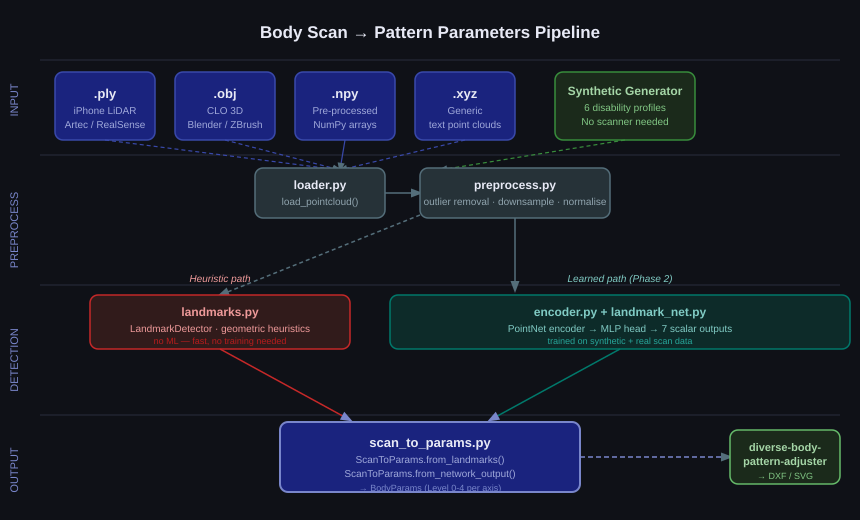
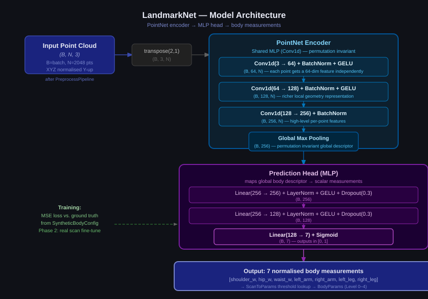
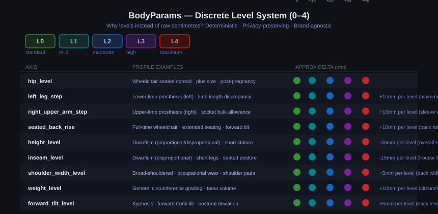

# body-pattern-research

The functionality as follows: **Point cloud body scan processing -> AI landmark detection -> individual sewing pattern parametrization**

This repo poses as a research toolkit for extracting body measurements from 3D scans using deep learning, and converting those measurements into discrete parameters for sewing pattern adjustment. Designed to feed into the following repo [diverse-body-pattern-adjuster](https://github.com/yourusername/diverse-body-pattern-adjuster), but fully functional as a standalone project.

---

## What This Repo Does Explicitly

Standard body scanning produces raw 3D geometry — millions of XYZ points with no semantic meaning. This project answers the question: *how do you turn a point cloud into the precise, clinically-grounded adjustments a pattern maker needs?*

The answer is a two-stage pipeline. First, a preprocessing step cleans and normalises the raw scan. Then either a fast heuristic detector or a trained neural network extracts key body measurements — shoulder width, hip width, arm/leg lengths, asymmetries. Those measurements are finally mapped into a discrete Level system (0–4 per body axis) that drives downstream pattern adjustment.



---

## Pipeline Overview

```
.ply / .obj / .npy  ──┐
                      ├──> loader.py ──> preprocess.py
synthetic generator ──┘          │
                                 ▼
                    ┌────────────┴────────────────┐
                    │ Heuristic                   │ Learned
                    │ LandmarkDetector            │ LandmarkNet
                    │ (landmarks.py)              │ (landmark_net.py)
                    └────────────┬────────────────┘
                                 ▼
                         scan_to_params.py
                         ScanToParams
                                 │
                          BodyParams  ──> diverse-body-pattern-adjuster
                         (Level 0–4)      PatternAdjuster → DXF
```

---

## The Neural Model — LandmarkNet

The core neural model is **LandmarkNet**: a PointNet-based encoder followed by a compact MLP that predicts 7 scalar body measurements from a raw point cloud.



### Why PointNet?

PointNet (Qi et al., CVPR 2017) is designed for exactly this problem: learning from unordered sets of 3D points. A body scan is inherently unordered — there is no canonical ordering of 50,000 surface points. PointNet handles this with two key ideas:

1. **Shared MLP** — the same small network processes each point independently, so point order doesn't matter
2. **Global max pooling** — the per-point features are aggregated into a single fixed-size vector by taking the maximum across all points, making the result completely permutation-invariant

This produces a 256-dimensional "body descriptor" — a compact representation of the global shape of the body. The MLP prediction head then maps this descriptor to 7 measurements.

### Why not a Transformer?

[NeuralTailor (SIGGRAPH 2022)](https://arxiv.org/abs/2201.13063) uses point-level attention (transformer-style) to reconstruct full sewing patterns from garment scans. That's a harder problem than this one: it predicts the shape of every panel, not just 7 scalar measurements. For body measurement extraction, a PointNet encoder is computationally lighter, easier to train on synthetic data, and sufficient for the task. The `PointNetPlusPlusEncoder` in `encoder.py` is a natural upgrade path for Phase 3 when real scan data is available.

### Model inputs and outputs

| Field  | Shape         | Description                                                  |
| ------ | ------------- | ------------------------------------------------------------ |
| Input  | `(B, N, 3)` | Batch of B point clouds, N=2048 points each, XYZ coordinates |
| Output | `(B, 7)`    | 7 normalised scalar measurements per scan                    |

The 7 output dimensions:

| Index | Measurement               | Notes                   |
| ----- | ------------------------- | ----------------------- |
| 0     | `shoulder_width_norm`   | Fraction of body height |
| 1     | `hip_width_norm`        | Fraction of body height |
| 2     | `waist_width_norm`      | Fraction of body height |
| 3     | `left_arm_length_norm`  | Fraction of body height |
| 4     | `right_arm_length_norm` | Fraction of body height |
| 5     | `left_leg_length_norm`  | Fraction of body height |
| 6     | `right_leg_length_norm` | Fraction of body height |

Normalising by body height makes the model height-agnostic: a Level 2 shoulder width means the same thing for a 130cm and a 180cm person.

### Training strategy

**Phase 1 — Synthetic data** (`scripts/generate_synthetic_body.py`)
Ground-truth measurements are known exactly from the `SyntheticBodyConfig` parameters. The generator produces anatomically plausible but not photorealistic body clouds for 6 disability profiles. Training on synthetic data first avoids the chicken-and-egg problem of needing labelled real scans before the model can work.

**Phase 2 — Real scan fine-tuning**
Once a dataset of real scans with annotated measurements is available, fine-tune the pre-trained model. The synthetic pre-training acts as a strong initialisation that requires far fewer real samples to converge.

**Loss function:** MSE on the 7-dimensional output vector. Evaluated per-axis with MAE (mean absolute error) so individual measurement quality is visible.

**Augmentation:** random Y-axis rotation (body can face any direction) + small Gaussian surface noise (simulates scan imperfection).

### XAI layer

The `scan_to_params.py` mapper includes an `explain()` method that makes every Level assignment traceable:

```
── Scan → BodyParams Mapping Explanation ──
  shoulder_width (norm=0.241)  ->  shoulder_width_level = 0
  hip_width      (norm=0.298)  ->  hip_level = 2
  arm_asymmetry  (Δ=0.412)    ->  left_arm=3  right_arm=0
  leg_asymmetry  (Δ=0.038)    ->  left_leg=1  right_leg=0
  height_level   = 0
  inseam_level   = 1
  weight_level   = 1
```

This transparency is essential for clinical trust, audit trails, and GDPR compliance. No raw body measurements are stored in the output — only the discrete Level assignments.

---

## The BodyParams Level System

The discrete Level system is the key innovation that makes this research clinically usable.



Rather than storing raw centimetre measurements (a concern and a source of inter-brand inconsistency), every body axis is encoded as a Level from 0 to 4. Level 0 means "standard base block is fine here." Level 4 means "maximum supported deviation." The actual mm offset is determined at export time by a brand-specific rule set.

**Why this matters:**

- **Privacy:** no personal measurements are stored, only ordinal deviations
- **Determinism:** the same Level always produces the same adjustment
- **Brand-agnostic:** the same Level 2 hip works for any base block
- **Clinical alignment:** Levels map naturally to how clinicians and pattern makers describe fit needs

---

## Supported Scan Formats

| Format   | Source                                    |
| -------- | ----------------------------------------- |
| `.ply` | iPhone LiDAR, Artec Eva, Intel RealSense  |
| `.obj` | CLO 3D, Blender, ZBrush                   |
| `.npy` | Pre-processed NumPy arrays (fastest)      |
| `.xyz` | Generic whitespace-delimited point clouds |

For `.ply` with normals/colour: `pip install plyfile`

---

## Quick Start

```bash
git clone https://github.com/yourusername/body-pattern-research.git
cd body-pattern-research
pip install -e ".[dev]"
```

**No scanner needed to start.** Generate synthetic body clouds first:

```bash
python scripts/generate_synthetic_body.py --output data/samples/ --n 3
```

**Run the full pipeline:**

```python
import numpy as np
from research.pointcloud.loader import load_pointcloud
from research.pointcloud.preprocess import PreprocessPipeline
from research.pointcloud.landmarks import LandmarkDetector
from research.mapping.scan_to_params import ScanToParams

# Load (or use synthetic)
pts = np.load("data/samples/wheelchair_000.npy")

# Preprocess: clean, downsample, normalise
pipe = PreprocessPipeline()
pts_clean, info = pipe(pts)

# Detect landmarks (heuristic — no model needed)
det = LandmarkDetector()
lm  = det.detect(pts_clean)

# Map to BodyParams
mapper = ScanToParams()
params = mapper.from_landmarks(lm, height_m=1.65)

print(params)
# BodyParams(hip_level=2, seated_back_rise=0, ...)

print(mapper.explain(lm, params))
# ── Scan -> BodyParams Mapping Explanation ──
# ...
```

**Use with diverse-body-pattern-adjuster (if installed):**

```python
# When diverse-body-pattern-adjuster is installed, BodyParams flows directly
# into the pattern adjustment engine:
from diverse_body_pattern_adjuster.pattern.adjustment import PatternAdjuster
adjuster = PatternAdjuster()
result   = adjuster.adjust(params)
print(adjuster.explain(params))
```

**Run tests:**

```bash
pytest tests/ -v
```

---

## Repository Structure

```
 body-pattern-research/
│
├── research/                          Core library
│   ├── core/
│   │   └── body_params.py            Standalone BodyParams + Level types
│   ├── pointcloud/
│   │   ├── loader.py                 Load .ply / .obj / .npy / .xyz
│   │   ├── preprocess.py             Clean, downsample, normalise, align
│   │   └── landmarks.py              Heuristic body landmark detector
│   ├── models/
│   │   ├── encoder.py                PointNet / PointNet++ encoders (PyTorch)
│   │   └── landmark_net.py           LandmarkNet — end-to-end scan -> measurements
│   └── mapping/
│       └── scan_to_params.py         Landmarks / network output -> BodyParams
│
├── scripts/
│   ├── generate_synthetic_body.py    Synthetic body cloud generator (6 profiles)
│   └── extract_landmarks.py          CLI: .ply -> landmarks -> BodyParams
│
├── docs/
│   ├── pipeline.svg                  Pipeline overview diagram
│   ├── model_architecture.svg        LandmarkNet architecture diagram
│   └── body_params_levels.svg        Level system reference table
│
├── data/
│   └── samples/                      .npy synthetic clouds (not committed)
│
├── notebooks/
│   ├── 01_explore_pointcloud.ipynb   Interactive scan exploration
│   └── 02_landmark_extraction.ipynb  Step-by-step landmark detection - TBC
│
└── tests/
    └── test_preprocessing.py         Tests for all pipeline stages
```

---

## Standalone vs. Integrated

This repo works independently — no other packages required.

```
body-pattern-research (this repo)
     │  fully self-contained
     │  research/core/body_params.py (local BodyParams)
     │
     │  optional integration ──> diverse-body-pattern-adjuster
                                  PatternAdjuster
                                  DXF / SVG export
```

When `diverse-body-pattern-adjuster` is installed alongside this repo, `ScanToParams` automatically uses its BodyParams, making the output directly compatible with pattern adjustment and DXF export. If it is not installed, the local `research/core/body_params.py` stub provides identical functionality.

---

## Disability Profiles — Synthetic Generator

The `generate_synthetic_body.py` script ships with 6 anatomically-informed profiles for development and testing. No scanner required.

| Profile                      | Description                                            |
| ---------------------------- | ------------------------------------------------------ |
| `standard`                 | Reference adult, 1.70m, 70kg                           |
| `wheelchair`               | Seated posture, widened hip spread, shorter leg region |
| `prosthesis_left_lower`    | Left lower limb 35% shorter (residual limb)            |
| `prosthesis_left_upper`    | Left upper arm 40% shorter, reduced radius             |
| `dwarfism_proportional`    | Overall scale 1.30m, all proportions reduced           |
| `dwarfism_disproportional` | Near-standard torso (1.25m), shortened limbs           |
| `plus_size`                | 110kg weight-class, wider hip/shoulder/thigh volumes   |

```bash
python scripts/generate_synthetic_body.py --list-profiles
python scripts/generate_synthetic_body.py --profile wheelchair --n 10 --output data/samples/
```

---

## Research Foundation

This project builds directly on the following papers; The NeuralTailor and SewPCT papers are the primary technical ancestors.

### NeuralTailor (SIGGRAPH 2022)

**Reconstructing Sewing Patterns from 3D Point Clouds of Garments in the Wild**
Korosteleva, M. & Lee, S.-H. — *ACM Transactions on Graphics, SIGGRAPH 2022*
https://arxiv.org/abs/2201.13063

NeuralTailor demonstrates that 3D garment point clouds can be decoded into 2D sewing patterns using point-level attention — operating on the garment surface geometry rather than image or voxel representations. This work establishes that panel shapes and stitching details can be reconstructed from unstructured 3D input.

**How this repo relates to NeuralTailor:** NeuralTailor works on *garment* scans to pattern reconstruction. This repo works on *body* scans to measurement extraction. The two are complementary: body-pattern-research extracts measurements, diverse-body-pattern-adjuster adjusts an existing pattern based on those measurements. A future Phase 3 could combine both: directly predict panel adjustments from body scans, NeuralTailor-style.

### SewPCT (2025)

**Sewing Pattern Reconstruction from Point Clouds using a Transformer**
*Lecture Notes in Computer Science, 2025*
https://link.springer.com/chapter/10.1007/978-3-031-82021-2_15

SewPCT extends NeuralTailor with a Point Cloud Transformer (PCT) architecture for dual prediction of both panel shapes and stitching details. The transformer's attention mechanism captures global context across all panels simultaneously, improving reconstruction of complex multi-panel garments.

**How this repo relates to SewPCT:** SewPCT's dual-prediction architecture is the inspiration for `PointNetPlusPlusEncoder` in `encoder.py`, which is the planned Phase 3 upgrade from the current PointNet baseline. The attention mechanism in SewPCT is architecturally equivalent to the transformer encoder block we plan to add for richer body landmark detection.

### PointNet and PointNet++ (CVPR 2017 / NeurIPS 2017)

**PointNet: Deep Learning on Point Sets for 3D Classification and Segmentation**
Qi, C.R. et al. — *CVPR 2017* — https://arxiv.org/abs/1612.00593

**PointNet++: Deep Hierarchical Feature Learning on Point Sets in a Metric Space**
Qi, C.R. et al. — *NeurIPS 2017* — https://arxiv.org/abs/1706.02413

PointNet provides the core insight that permutation invariance can be achieved with shared MLPs + max pooling. PointNet++ extends this with hierarchical local neighbourhood grouping (ball-query + FPS), which captures fine local geometry — important for accurately detecting shoulder and hip landmarks.

**Current implementation:** `PointNetEncoder` (Phase 1, training on synthetic data). `PointNetPlusPlusEncoder` scaffolded in `encoder.py` for Phase 3.

### Made-to-Measure from 3D Body Scans (2008)

**Made-to-Measure Pattern Development Based on 3D Whole Body Scans**
Xu, B. et al. — *International Journal of Clothing Science and Technology, 2008*
https://www.researchgate.net/publication/243462865

The foundational study demonstrating that 3D-to-2D pattern transfer from body scans produces superior fit vs. traditional measurement-based grading. Establishes the body landmark taxonomy (shoulder, hip, inseam, waist) that this repo's `BodyLandmarks` class implements.

---

## How this project differs from the papers

A common question: if NeuralTailor already solves "point cloud -> sewing pattern", why does this project exist?

**NeuralTailor and SewPCT are end-to-end reconstruction systems.** Given a point cloud, they output a complete new garment pattern from scratch. They must learn everything — body shape, garment topology, seam geometry — from many thousands of training examples. The output is a full panel layout for one specific garment.

**This project takes a decomposed approach** that is closer to how a tailor actually works:

```
Real tailor workflow:
  1. Measure the person (shoulder, hip, inseam, ...)
  2. Take a standard block pattern for the garment
  3. Apply calculated adjustments to the block

This project:
  1. body-pattern-research: scan -> BodyParams (discrete levels)
  2. diverse-body-pattern-adjuster: BodyParams -> mm deltas -> adjusted DXF
```

This has several practical advantages:

|                      | End-to-end (NeuralTailor)                | This project                          |
| -------------------- | ---------------------------------------- | ------------------------------------- |
| Training data needed | Thousands of labelled scan/pattern pairs | Hundreds of scan/measurement pairs    |
| Output               | Full pattern reconstruction              | Adjustment of an existing block       |
| Integration with CAD | Custom format                            | Standard DXF (Gerber, Lectra, CLO 3D) |
| Explainability       | Black box                                | Every delta is named and traceable    |
| Disability support   | Not designed for it                      | Core design requirement               |
| Requires T-pose scan | Yes                                      | Currently yes, planned: relaxed       |

**What we directly borrow from the papers:**

- *From PointNet:* the Conv1d shared-MLP + global max-pooling architecture (permutation invariance), unit-sphere normalisation, the idea that a 1024-dim global descriptor captures body shape
- *From PointNet++:* the hierarchical FPS + ball-query grouping in `PointNetPlusPlusEncoder`
- *From NeuralTailor:* proof that synthetic scan data (ellipsoidal + SMPL meshes) transfers to real-world use; the 2000-point downsampling convention; canonical pose alignment as a preprocessing requirement

**How PointNet and NeuralTailor differ from each other:**

PointNet is a *general-purpose* point cloud encoder — it knows nothing about bodies or garments. It could classify chairs, aeroplanes, or cups. NeuralTailor uses a PointNet encoder but adds a purpose-built garment decoder that knows about panel topology, seam connectivity, and stitch graphs. The encoder is the same; the difference is entirely in what the network is trained to predict on top of it.

This project's `LandmarkNet` is architecturally closer to plain PointNet — a general encoder + regression head. The "garment knowledge" lives in the adjuster's rule engine, not in the neural network. This separation makes the neural component easier to train (the labels are scalar body measurements, not complex panel geometries) and the pattern logic easier to inspect and override.

---

## Notebook

[`notebooks/01_pointcloud_to_explain.ipynb`](notebooks/01_pointcloud_to_explain.ipynb) — full walkthrough from raw point cloud to `explain()` output, with visualisations of each preprocessing step, landmark band extraction, and BodyParams comparison across all disability profiles.

---

## Algorithm documentation

[`docs/ALGORITHMS.md`](docs/ALGORITHMS.md) covers:

- The `scan_to_params.py` translation layer in detail (why Levels, how thresholds work, asymmetry detection)
- All preprocessing maths (SOR filter, downsampling, unit-sphere normalisation, PCA alignment) with paper citations
- The heuristic landmark extraction — every geometric formula explained
- PointNet encoder architecture with the permutation invariance proof
- Full comparison table: this project vs. PointNet vs. NeuralTailor vs. SewPCT
- Reference to to public datasets usable (CAESAR, SMPL, FAUST, Kaggle) with quick-start code

---

## Roadmap

| Phase | Focus                                                                 | Status  |
| ----- | --------------------------------------------------------------------- | ------- |
| 0     | Preprocessing, heuristic landmarks, synthetic generator, ScanToParams | Done    |
| 1     | LandmarkNet training on synthetic data, MAE evaluation                | Next    |
| 2     | XAI explanations (integrated gradients via captum)                    | Next    |
| 3     | Real scan fine-tuning, PointNet++ upgrade, scan -> seam direct path  | Planned |

---

## License

MIT

---

## Author

Ilona Eisenbraun — XAI Researcher, formerly Fraunhofer HHI / HTW Berlin
